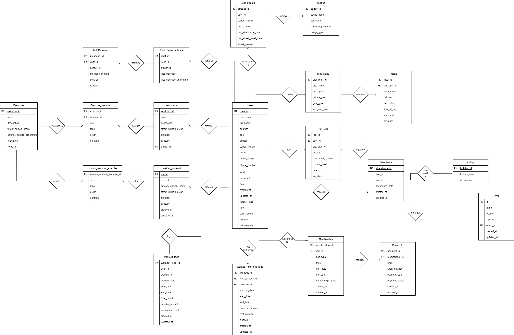

# Gymify

## Project Overview

**Gymify** is a comprehensive platform designed to manage all aspects of a gym, including user management, workout tracking, diet planning, gym attendance, and communication between trainers and users. This project features an **admin panel built with React**, a **mobile app for users developed with Flutter**, and a **backend API built using Express.js** with a PostgreSQL database for data management.

### Key Features

- **User Management**: Users can create profiles, track their fitness goals, and manage their subscriptions to gyms. Trainers and gym owners have separate management interfaces to monitor and assist users.
- **Workout Management**: Trainers can create and assign predefined workouts, while users can create their own custom workout plans. Workouts are linked to exercises, which include details like calories burned and target muscle groups.
- **Diet Planning and Tracking**: Trainers can create diet plans for users, which include multiple meals with calorie and nutrition information. Users can track their diets, weight, BMI, and set calorie goals based on their fitness objectives (weight loss, muscle gain, maintenance).
- **Attendance Tracking**: Gym attendance is tracked using RFID cards, allowing users to log their gym visits. The system keeps a record of streaks (consecutive days of attendance), and users can earn rewards for maintaining their attendance streaks.
- **Subscriptions and Payments**: Users can subscribe to gyms with different plans (monthly, yearly, etc.), and payments are processed with a status tracking system. Subscription details, start/end dates, and payment statuses are managed efficiently.
- **Chat System**: Integrated chat feature that allows users to communicate directly with trainers for guidance and feedback.
- **Admin Panel**: Gym owners and admins can monitor gym activity, user subscriptions, payments, and more through a React-based admin dashboard.
- **Mobile App**: Users access the system via a Flutter-based mobile application, allowing them to view workout plans, diet progress, track attendance, and chat with trainers on the go.

## Tech Stack

### Frontend

- **Admin Panel**: Built with **React**, the admin panel offers a responsive interface for gym owners and trainers to manage users, subscriptions, and gym operations.
- **User Mobile App**: Developed using **Flutter**, providing users with a smooth and intuitive interface for tracking their progress, accessing workout plans, and managing gym attendance.

### Backend

- **Express.js**: The backend is powered by **Express.js**, which serves as the API layer for handling user data, workout plans, diet tracking, chat, and attendance. The API is designed with RESTful principles to ensure scalability and ease of use.
- **PostgreSQL**: A **PostgreSQL** database is used to manage user data, workouts, subscriptions, payments, and gym information. The schema is designed with normalization principles to ensure efficient querying and data consistency.

## Features Breakdown

### Admin Panel (React)

- Manage gym operations, including user subscriptions, payments, and workouts.
- View and track user attendance, streaks, and performance.
- Access analytics related to gym activities, user progress, and overall performance.

### Mobile App (Flutter)

- Users can sign up, create profiles, and view their workout and diet plans.
- Access a detailed view of their progress, including current weight, BMI, and attendance streaks.
- Chat directly with trainers for personalized guidance.
- Receive notifications and updates about workouts, diet plans, and gym attendance.

### Backend API (Express.js)

- Secure API endpoints for user authentication, gym management, workout and diet tracking.
- Real-time chat system for trainers and users.
- Subscription and payment handling with status tracking.

## Installation and Setup

### Prerequisites

- **Node.js** for backend (Express.js)
- **Flutter SDK** for mobile app development
- **React** for admin panel
- **PostgreSQL** for database management

### Steps to Run the Project

1. **Clone the repository**:
    
    ```bash
    bash
    Copy code
    git clone https://github.com/AashishRauniyar/fyp-gymify
    
    ```
    
2. **Backend Setup**:
    - Navigate to the backend directory:
        
        ```bash
        bash
        Copy code
        cd be
        
        ```
        
    - Install the dependencies:
        
        ```bash
        bash
        Copy code
        npm install
        
        ```
        
    - Set up the PostgreSQL database and environment variables:
        
        ```bash
        bash
        Copy code
        cp .env.example .env
        
        ```
        
    - Run the backend server:
        
        ```bash
        bash
        Copy code
        npm run dev
        
        ```
        
3. **Front end Admin Panel Setup**:
    - Navigate to the admin panel directory:
        
        ```bash
        bash
        Copy code
        cd fe
        
        ```
        
    - Install the dependencies:
        
        ```bash
        bash
        Copy code
        npm install
        
        ```
        
    - Run the admin panel in development mode:
        
        ```bash
        bash
        Copy code
        npm run dev
        
        ```
        
4. **Mobile App Setup**:
    - Navigate to the Flutter app directory:
        
        ```bash
        bash
        Copy code
        cd mobile
        
        ```
        
    - Install the dependencies:
        
        ```bash
        bash
        Copy code
        flutter pub get
        
        ```
        
    - Run the Flutter app on a device or emulator:
        
        ```bash
        bash
        Copy code
        flutter run
        
        ```
        

## More Features

- **Push Notifications**: Integrate Firebase for push notifications to alert users about workout plans, diet reminders, and gym updates.

# Business Rules

### **1. Users**

- A user has attributes: user_name, full_name, address, age, height, current_weight, gender, email, password, phone number, role, fitness level, goal type, card number, created_at, and updated_at.
- A user has one active membership at a time.
- A user has attendance records to track gym visits.
- A user has the ability to view exercises and predefined workout plans.
- A user has the capability to create custom workouts by adding predefined exercises to them.
- A user has diet plans and logs their diet intake.
- A user has the ability to make payments for memberships using methods such as Khalti.
- A user has the option to participate in chat conversations with trainers and receive notifications.
- **Uniqueness**: Each user has a unique email and phone number.
- **Optional or Mandatory**:
    - **Mandatory**: user_name, full_name, email, password, phone_number, address, fitness_level, goal_type, current_weight, height.
    - **Optional**: profile image, card_number.

---

### **2. Memberships**

- A membership has a plan_type, start_date, end_date, status, created_at, and updated_at.
- A membership is unique to each user and is associated with a specific gym.
- **Uniqueness**: Each membership is unique to a user_id.
- **Optional or Mandatory**:
    - **Mandatory**: user_id, plan_type, start_date, end_date, status.

---

### **3. Payments**

- A payment has attributes: membership_id, user_id, amount_paid, payment_method, transaction_id, payment_date, and payment_status.
- A payment is linked to a specific user’s membership.
- A payment has status options such as paid, pending, or failed.
- **Uniqueness**: Each payment has a unique transaction_id.
- **Optional or Mandatory**:
    - **Mandatory**: membership_id, user_id, amount_paid, payment_method, payment_date, payment_status.

---

### **4. Workouts**

- A workout has attributes: workout_name, description, target muscle group, difficulty, created_at, and updated_at.
- A workout is created by a trainer and has multiple exercises.
- **Uniqueness**: Each workout has a unique workout_name per trainer.
- **Optional or Mandatory**:
    - **Mandatory**: workout_name, description, target muscle group, difficulty.

---

### **5. Exercises**

- An exercise has attributes: exercise_name, calories burned per minute, and created_at.
- An exercise is included in multiple workouts.
- **Uniqueness**: Each exercise has a unique exercise_name.
- **Optional or Mandatory**:
    - **Mandatory**: exercise_name, calories burned per minute.

---

### **6. WorkoutExercises**

- The WorkoutExercises table links workouts to exercises and has attributes: workout_id, exercise_id, sets, reps, and duration.
- **Uniqueness**: Each entry in the WorkoutExercises table has a unique combination of workout_id and exercise_id.
- **Optional or Mandatory**:
    - **Mandatory**: workout_id, exercise_id, sets, reps, duration.

---

### **7. CustomWorkouts**

- A custom workout has attributes: custom_workout_name, created_at.
- A custom workout is created by a user and has multiple predefined exercises.
- **Uniqueness**: Each custom workout is unique to a user.
- **Optional or Mandatory**:
    - **Mandatory**: custom_workout_name.

---

### **8. CustomWorkoutExercises**

- Links exercises to custom workouts with attributes: custom_workout_id, exercise_id, sets, reps, duration.
- **Uniqueness**: Each entry in CustomWorkoutExercises has a unique combination of custom_workout_id and exercise_id.
- **Optional or Mandatory**:
    - **Mandatory**: custom_workout_id, exercise_id, sets, reps, duration.

---

### **9. DietPlans**

- A diet plan has attributes: calorie_goal, goal_type, description, created_at, and updated_at.
- A diet plan is created by a trainer and includes multiple meals.
- **Uniqueness**: Each diet plan has a unique goal_type per user.
- **Optional or Mandatory**:
    - **Mandatory**: user_id, trainer_id, calorie_goal, goal_type, description.

---

### **10. Meals**

- A meal has attributes: meal_name, meal_time, calories, description, macronutrients, and created_at.
- A meal is part of a diet plan and is assigned to a specific time of day (e.g., breakfast).
- **Uniqueness**: Each meal has a unique meal_name within a diet plan.
- **Optional or Mandatory**:
    - **Mandatory**: meal_name, meal_time, calories, description.

---

### **11. DietLogs**

- DietLogs track a user's diet intake with attributes: diet_plan_id, meal_id, consumed_calories, custom_meal, notes, log_date.
- **Uniqueness**: Each diet log entry has a unique combination of user_id and log_date.
- **Optional or Mandatory**:
    - **Mandatory**: user_id, diet_plan_id, meal_id, consumed_calories, log_date.

---

### **12. WorkoutLogs**

- WorkoutLogs track a user's workouts with attributes: workout_date, start_time, end_time, total_duration, calories_burned, performance_notes.
- **Uniqueness**: Each workout log entry has a unique combination of user_id and workout_date.
- **Optional or Mandatory**:
    - **Mandatory**: user_id, workout_id, workout_date, start_time, end_time, total_duration.

---

### **13. WorkoutExercisesLogs**

- Tracks each exercise completed in a workout session with attributes: workout_log_id, exercise_id, start_time, end_time, exercise_duration, rest_duration, and skipped.
- **Uniqueness**: Each entry has a unique combination of workout_log_id and exercise_id.
- **Optional or Mandatory**:
    - **Mandatory**: workout_log_id, exercise_id, start_time, end_time, exercise_duration.

---

### **14. Attendance**

- Tracks gym attendance with attributes: user_id, gym_id, attendance_date, and status.
- **Uniqueness**: Each attendance record is unique for a combination of user_id, gym_id, and attendance_date.
- **Optional or Mandatory**:
    - **Mandatory**: user_id, gym_id, attendance_date, status.

---

### **15. Notifications**

- Users receive notifications with attributes: message, is_read, created_at.
- Notifications inform users of updates, reminders, or alerts.
- **Optional or Mandatory**:
    - **Mandatory**: user_id, message, is_read.

---

### **16. ChatConversations**

- Chat conversations include user_id, trainer_id, last_message, and last_message_timestamp.
- **Uniqueness**: Each chat conversation has a unique combination of user_id and trainer_id.
- **Optional or Mandatory**:
    - **Mandatory**: user_id, trainer_id, last_message.

---

### **17. ChatMessages**

- ChatMessages include chat_id, sender_id, message_content, sent_at, and is_read.
- Each chat conversation has multiple messages.
- **Uniqueness**: Each chat message entry is unique to a chat_id.
- **Optional or Mandatory**:
    - **Mandatory**: chat_id, sender_id, message_content, sent_at.

// image

